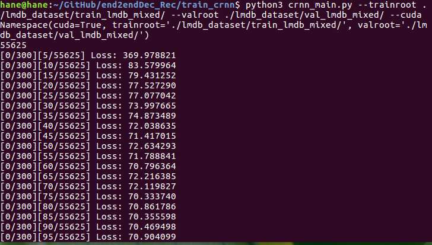
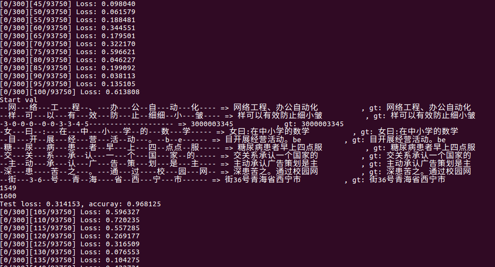

# Characters Recognition

A Chinese characters recognition repository based on convolutional recurrent networks. 

## Performance

#### Recognize characters in pictures

<p align='center'>
</img>
</p>
<p align='center'>
</img>
</p>

## Data
#### Synthetic Chinese String Dataset
1. Download the dataset in [here](https://pan.baidu.com/s/1ufYbnZAZ1q0AlK7yZ08cvQ)
2. Put char_std_5990.txt in lib/dataset/txt/
3. Download the preprocessed labels in [here](https://pan.baidu.com/s/1rd4tm0sCq5fFgB2ziUxcrA) (password:w877)
4. And put train.txt and test.txt in lib/dataset/txt/

## Data
#### Synthetic Chinese String Dataset
1. Download the dataset in [here](https://pan.baidu.com/s/1ufYbnZAZ1q0AlK7yZ08cvQ)
2. Put *char_std_5990.txt* in **lib/dataset/txt/**
3. Download the preprocessed labels in [here](https://pan.baidu.com/s/1rd4tm0sCq5fFgB2ziUxcrA) (password:w877)
4. And put *train.txt* and *test.txt* in **lib/dataset/txt/**

#### Dev Environments
1. WIN 10 or Ubuntu 16.04
1. pytorch 1.4.0 (may fix ctcloss)
2. yaml
3. easydict

## Train
```angular2html
   [run] python train.py --cfg lib/config/360CC_config.yaml
```
#### loss curve

```angular2html
   [run] cd output/360CC/crnn/xxxx-xx-xx-xx-xx/
   [run] tensorboard --log_dir log
```

#### loss overview
<p>
</img>
</p>
<p>
</img>
</p>

## Demo
```angular2html
   [run] python demo.py --image_path images/test.png --checkpoints output/checkpoints/mixed_second_finetune_acc_97P7.pth
```
## References
- https://github.com/meijieru/crnn.pytorch
- https://github.com/HRNet


